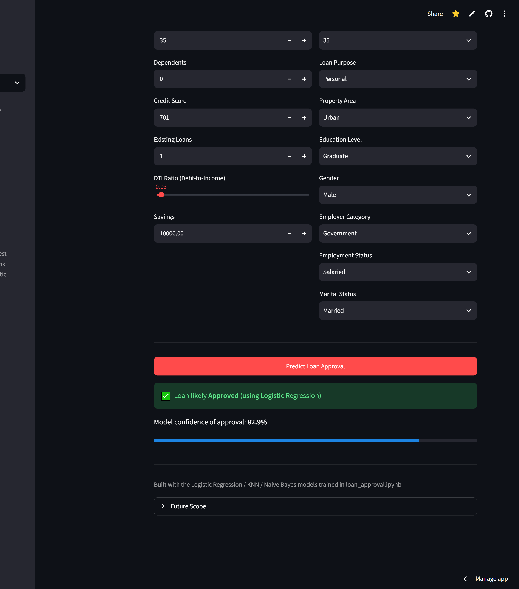
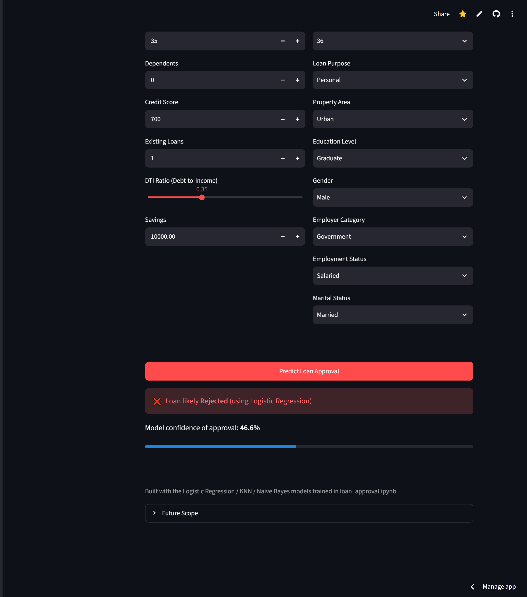

# 🏦 Loan Credit Risk Prediction


---
##  Live Demo

 **Try the deployed application here:**

**https://loan-credit-risk-ml.streamlit.app/**

---



##  Project Overview

This project analyzes loan application data and builds a Machine Learning model to predict whether a loan application will be **Approved** or **Rejected** based on an applicant's financial and personal information.Implemented Binary Classification along with EDA, Feature Engineering & Model Evaluation with (Precision, Recall, F1 Scores)

---

## 🚀 Tech Stack

- Python
- NumPy
- Pandas
- Matplotlib
- Seaborn
- Scikit-Learn
- Joblib
- Streamlit

---

## Project Workflow

1. Data Collection
2. Data Cleaning
3. Exploratory Data Analysis (EDA)
4. Feature Engineering
5. Data Preprocessing
6. Model Training
7. Model Evaluation
8. Loan Prediction
9. Streamlit Deployment

---

## Key Insights

- Applicants with **higher Credit Scores** have a significantly higher chance of loan approval.
- **Applicant Income alone** is not a strong indicator of loan approval.
- Lower **Debt-to-Income (DTI) Ratio** is generally associated with approved loans.
- Applicants with **higher Savings and Collateral Value** tend to receive more approvals.
- Credit Score is one of the **strongest predictive features** in the dataset.

---
##  Machine Learning Models

- Built and evaluated **Logistic Regression, K-Nearest Neighbors (KNN), and Naive Bayes** for loan approval prediction.
- Performed **data preprocessing**, including missing value handling, feature encoding, train-test split, and feature scaling.
- Conducted **EDA** to analyze income, credit score, DTI ratio, and their impact on loan approval.
- Applied **feature engineering** by creating transformed features from Credit Score and DTI Ratio to improve model performance.
- **Logistic Regression:** Balanced performance with **Precision: 78%** and **Recall: 77%**.
- **KNN:** Underperformed on this dataset with **Recall: 49%**, making it less suitable.
- **Naive Bayes:** Achieved the **highest Precision (80%)**, making it the preferred model when minimizing approvals of high-risk customers is the priority.
- **Final Outcome:** **Naive Bayes** selected as the best model based on precision, while **Logistic Regression** offered the best balance between precision and recall after feature engineering.
  
---

## 📂 Project Structure

```
loan-credit-risk/
│
├── app.py
├── loan_approval.ipynb (Notebook)
├── model.pkl
├── scaler.pkl
├── requirements.txt
├── README.md
└── loan_approval_dataset.csv
```

---
##  Run Locally

Clone the repository:

```bash
git clone https://github.com/banshita61rout/loan-credit-risk.git
```

Install dependencies:

```bash
pip install -r requirements.txt
```

Run the Streamlit application:

```bash
streamlit run app.py
```

---


## 📌 Future Improvements

- Hyperparameter Tuning
- Feature Engineering
- Model Comparison
- Deploy using Streamlit/Flask

---

## 📸 Live Application

 **Streamlit App:** https://loan-credit-risk-ml.streamlit.app/

---
### ⭐ If you found this project useful, consider giving it a Star!